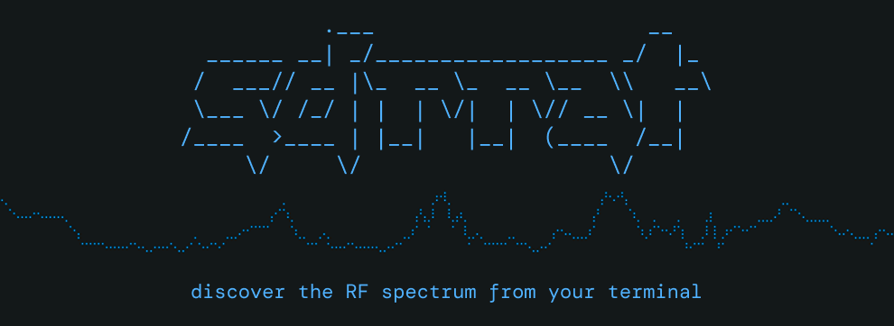
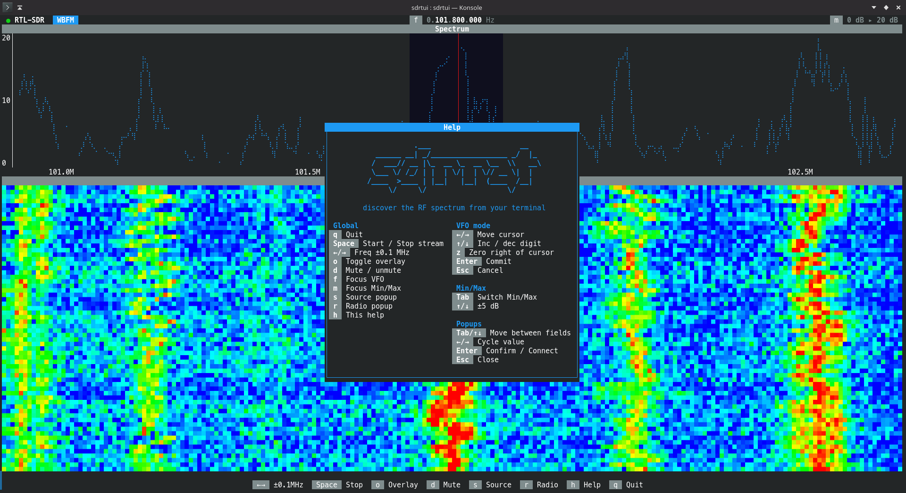

**sdrrat** is a general purpose SDR (Software Defined Radio) receiver TUI (Terminal User Interface) application that interfaces with your SDR hardware and allows you to view the RF spectrum and demodulate signals from your terminal. It's built with Rust, [Ratatui](https://ratatui.rs) and [FutureSDR](https://www.futuresdr.org/).

> [!WARNING]
> sdrrat is currently **not stable**, please open an issue for any bugs or crashes you encounter


## Features

- **RTL-SDR** and **HackRF** support
- **FFT spectrum** graph
- **Waterfall spectrogram** graph
- Source **sample rate** and **gain** control
- **WBFM, NBFM**  and **AM** demodulation
- Basic **squelch**
- **Intuitive and easy to use** terminal user interface (TUI)

Watch the showcase video below!

https://github.com/user-attachments/assets/874f4fe0-34fa-4c63-ad54-e0a77fab1622

sdrrat has most of the basic features you can expect from an SDR receiver, though it's lacking most advanced features. You can request any missing features by opening an issue.

## Key Bindings

### Global

| Key | Action |
|-----|--------|
| `q` | Quit (config saves on exit) |
| `Space` | Start / Stop the data stream |
| `←` / `→` | Nudge frequency by ±0.1 MHz |
| `o` | Toggle the spectrum overlay (bandwidth shading + center line) |
| `d` | Mute / unmute audio (toggles between Off and the last active mode) |
| `f` | Focus the **VFO** for digit-by-digit tuning |
| `m` | Focus the **Min/Max** dB-range stepper |
| `s` | Open the **Source** popup (device, sample rate, gain) |
| `r` | Open the **Radio** popup (demod mode, squelch) |
| `h` | Open the in-app **Help** popup |

### VFO mode (after `f`)

| Key | Action |
|-----|--------|
| `←` / `→` | Move cursor left/right by one digit |
| `↑` / `↓` | Increment / decrement the focused digit (±10ⁿ) |
| `z` | Zero out all digits to the right of the cursor |
| `Enter` | Commit and exit |
| `Esc` | Cancel, restore the frequency from when the popup opened |

### Min/Max mode (after `m`)

| Key | Action |
|-----|--------|
| `Tab` | Switch focus between Min and Max |
| `↑` / `↓` | Adjust focused value by ±5 dB |
| `Enter` | Commit and exit |
| `Esc` | Cancel, restore prior bounds |

### Popups

| Key | Action |
|-----|--------|
| `Tab` / `↑` / `↓` | Move between fields |
| `←` / `→` | Cycle value |
| `Enter` | Confirm |
| `Esc` | Close |

## Architecture

There are two threads doing work. The UI thread runs the ratatui draw loop and reads keypresses. The DSP thread owns the SDR hardware and runs all the signal processing. They talk through a couple of `crossbeam_channel`s: one carries FFT magnitude frames toward the UI, the other carries user commands (tune to this frequency, change sample rate, set squelch, etc.) toward the DSP. Neither side ever blocks on the other.

The DSP thread itself is mostly a thin shell around a [FutureSDR](https://futuresdr.org/) flowgraph. FutureSDR handles the scheduling of all the actual blocks (the SDR source, the FFT, the FIR filters and resamplers, the audio sink) and we wire it together once at startup. A small command-pump task inside the runtime drains the command channel and forwards changes either to the source block's message ports (frequency, sample rate, gain, which it knows how to pass through to SoapySDR) or to a handful of shared atomics that the DSP blocks read every sample (squelch threshold, current demod mode, audio volume).

A `Supervisor` struct in `main.rs` owns the DSP thread's lifecycle. When you press Space to stop, or change the device or sample rate and press Apply, the supervisor sets a per-thread quit flag, joins the DSP thread, and calls FutureSDR's `stop_and_wait` so every block gets to run its `deinit()` cleanly. The SDR streamer deactivates, the cpal audio stream releases, no orphaned threads. Then on the next Start the supervisor spawns a new thread with fresh channels.

### The flowgraph

The source is a `seify::Source` configured with a SoapySDR driver string for whichever device is selected. It produces I/Q samples that fan out (via a custom `Tee` block, since FutureSDR's stream buffers are single-reader) to two parallel paths.

The **spectrum path** is the boring one: 1024-point FFT, magnitude in dB, and a custom `ChunkSink` that batches the f32 samples into FFT-sized frames and pushes them through the channel to the UI. That's what you see drawn as the spectrum graph and the waterfall.

The **demod path** branches again into two sub-chains:

- The **wideband FM chain** decimates the I/Q stream to about 256 kHz, runs a quadrature discriminator tuned for +/- 75 kHz deviation, resamples down to 48 kHz audio, applies a 75 us de-emphasis filter, and ends in a volume gate.
- The **narrow chain** decimates harder, down to about 32 kHz, and shares a single `Apply` block that dispatches to either an FM discriminator (for NBFM) or an envelope detector with DC blocking (for AM), depending on the current mode atomic. Because the dispatch is a runtime check on an `AtomicU8`, switching between NBFM and AM doesn't require rebuilding the flowgraph. The same narrow IQ stream feeds a power meter that updates the signal-power atomic the squelch reads.

Both demod sub-chains end in their own volume gate, and a `Combine` block sums them into the cpal audio sink. At any moment at most one chain has a non-zero volume, so the sum is just whatever's active.

The exact decimation factors aren't hardcoded. They're computed from whatever sample rate the device is running at, targeting about 256 kHz for WBFM and 32 kHz for narrow modes. That's why changing the sample rate in the Source popup forces a flowgraph rebuild: the FIR filters are designed at build time.

### Module layout

```
src/
├── main.rs            entry point + DSP supervisor
├── app/               UI-side state and key handlers
│   ├── mod.rs         App struct, AppMode, channel I/O, key dispatch
│   ├── vfo.rs         frequency tuning helpers + VFO key handler
│   ├── db_range.rs    Y-axis stepper
│   ├── source.rs      Source popup state + sample-rate / gain options
│   ├── radio.rs       Radio popup state + mode helpers
│   └── persist.rs     TOML config load/save (via confy)
├── dsp/               DSP thread + flowgraph
│   ├── mod.rs         public API
│   ├── device_kind.rs DeviceKind enum (RTL-SDR, HackRF) + per-device args/range
│   ├── command.rs     DspCommand + shared atomics + the command pump
│   ├── flowgraph.rs   the full FutureSDR flowgraph builder
│   ├── tee.rs         1-in 2-out fanout block
│   ├── sink.rs        ChunkSink: batches f32 samples into FFT-sized frames
│   └── silence.rs     RAII guard that redirects stderr around noisy native calls
└── ui/                ratatui drawing
    ├── mod.rs         top-level draw
    ├── theme.rs       colour constants
    ├── util.rs        downsample + small layout helpers
    ├── spectrum.rs    FFT spectrum graph widget
    ├── waterfall.rs   waterfall graph widget
    ├── status_bar.rs  bottom controls strip
    ├── header/        top row (connection status, VFO, dB range)
    └── popup/         Source / Radio / Help popups + shared chrome
```

## License

sdrrat is licensed under the MIT license.
